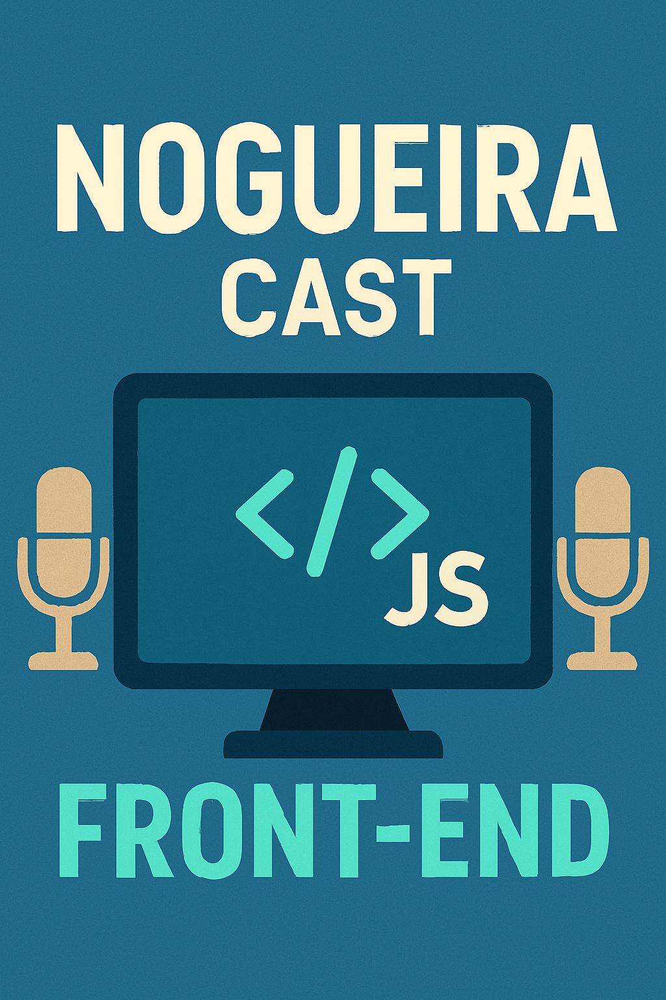

    Preview do podcast

    <audio src="output/podcast_editado.MP3" controls title="Podcast editado"></audio>

# Projeto Podcast Gerado por I.A.s

 > ℹ️ **NOTE:** Este repositório foi desenvolvido durante o curso trainee santander - Universia 2025 na plataforma de cursos [DIO](https://web.dio.me/users/nogueira_devmasters)

Projeto com o objetivo de gerar um podcast utilizando ferramentas de IA através de prompts.

##  Audio e Video
 

## 💻 Tecnologias utilizadas no projeto

- [Microsoft Copilot](https://copilot.microsoft.com/)
- [ElevenLabs](https://beta.elevenlabs.io/)
- [Capcut](https://www.capcut.com/pt-br/)

## ✨ Como foi feito ?

- Roteiro gerado via microsoft copilot
- Audio gerado pela elevenLabs
- imagem gerada pelo microsoft Copilot
- Capcut edição de audio

## 📚 Materiais

- [Link da live no Youtube](https://www.youtube.com)
- [Notion Template](https://helpful-jump-17b.notion.site/PAS-Podcast-AI-Studio-210489e15d7a4a73b743bb159e45d06f?pvs=4)
- [Editor de aúdio](https://www.capcut.com/editor?from_page=landing_page&__action_from=picture_V%C3%ADdeos%20profissionais%20em%20minutos,%20n%C3%A3o%20em%20horas.)

## 👨‍💻 Expert

    
    
&nbsp&nbsp&nbspFelipe Aguiar 
    &nbsp&nbsp&nbsp
    <a 
        href="https://github.com/Marcel-Nogueira">
        GitHub
    </a>
    &nbsp;|&nbsp;
    <a 
        href="https://www.linkedin.com/in/marcel-nogueira1/">
        LinkedIn
    </a>
    &nbsp;|&nbsp;
   

  

---

Por: [Marcel Nogueira](https://github.com/Marcel-Nogueira)